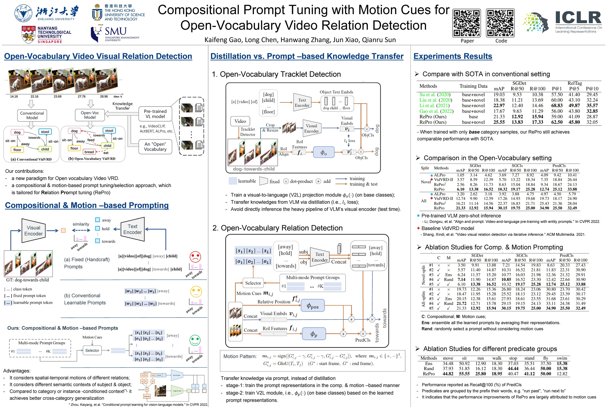

Official code for our ICLR2023 paper: "Compositional Prompt Tuning with Motion Cues for Open-Vocabulary Video Relation Detection"
[openreview link](https://openreview.net/pdf?id=mE91GkXYipg) 


# **[Update]** train & eval code for VidVRD dataset is ready

# **[Update]** All traj data for VidOR has been released, for checkpoint, refer to [links in this issue](https://github.com/Dawn-LX/OpenVoc-VidVRD/issues/8#issuecomment-2103847250)
# Requirements

- Python == 3.7 or later, Pytorch == 1.7 or later
- transformers == 4.11.3 (new version might require some modifications for ALpro's code, but also works， refer to Line 872 in `Alpro_modeling/xbert.py`) 
- for other basic packages, just run the project and download whatever needed.

# Data-release summarize

Actually, the raw video data (.mp4 files) is not required to run this repo. We provide the pre-prepared traj data (include bbox and features)

**Overview**: There are 3 types of data
- tacklet bbox (or traj bbox): bounding box sequence after object tracking. 
    - Here we use Seq-NMS to perform tracking, and we do tracking in each video segment (30 frame per seg)
- traj RoI features: 2048-d RoI features obtained by FasterRCNN's RoI-Align. Here we use [VinVL](https://github.com/pzzhang/VinVL) (its model structure is FasterRCNN). 
    - We extracted the RoI feature for each tracklet (i.e., each bbox in the bbox sequence), and averaged the feature along the time axis (the released data is after this averaging).
- traj embds: 256-d embeddings obtained by the video-language pre-train model [ALpro](https://github.com/salesforce/ALPRO). 
    - **NOTE**: we call this as embedding (in README file and our code) to distinguish it with the 2048-d RoI feature.
    - Also NOTE that this is not extracted per-box of the tracklet and averaged along time axis. ALPro takes as input the video segment and output the 256-d embedding directly. In our implementation, we crop the video region according to the traj bboxes, and take this as the input to ALpro.

For each type of the above data, it includes `gt` and `det`, i.e., ground-truth traj bboxes and detection traj bboxes, with their features/embds. (certainly, we don't need Seq-NMS to perform tracking for `gt`)

## Code for prepare the above traj data
Please refer to this repo [VidSGG-TrajDataPrepare](https://github.com/Dawn-LX/VidSGG-TrajDataPrepare) for how to prepare the above traj data.

## VidVRD

### Pre-prepared traj data ([MEGA cloud link](https://mega.nz/folder/AYBkxCaI#QCqV3cnIdY_9DXGUnCtSvA))

In detail, there are the following files: (where `data0/` refers to `/home/gkf/project/`)

- object category text embedding: `vidvrd_ObjTextEmbeddings.pth` corresponding to (c.t.) `data0/VidVRD-OpenVoc/prepared_data/vidvrd_ObjTextEmbeddings.pth`

- traj bbox 
    - gt (200 test videos): `vidvrd_traj_box_gt.zip`, c.t. `data0/scene_graph_benchmark/output/VidVRDtest_tracking_results_gt`
    - gt (800 train videos): `vidvrd_traj_box_gt_trainset.zip`, c.t. `data0/scene_graph_benchmark/output/VidVRD_tracking_results_gt`
    - det (all 1k videos):  `vidvrd_traj_box_det.zip`, c.t. `data0/VidVRD-II/tracklets_results/VidVRD_segment30_tracking_results`
    - det-th-15-5 (all 1k videos):  `vidvrd_traj_box_det_th-15-5.zip`, c.t. `data0/VidVRD-OpenVoc/vidvrd_traj_box_det_th-15-5.zip`
        - this is used for TrajCls module only, it can be obtained by filter out trajs with length < 15 and area < 5, but we also provide this data to make sure.

- traj RoI features (2048-d)
    - gt (200 test videos): `vidvrd_traj_roi_gt.zip`, c.t. `data0/scene_graph_benchmark/output/VidVRDtest_gt_traj_features_seg30`
    - gt (800 train videos): `vidvrd_traj_roi_gt_trainset`, c.t. `data0/scene_graph_benchmark/output/VidVRD_gt_traj_features_seg30`
    - det: (all 1k videos) `vidvrd_traj_roi_det.zip`, c.t. `data0/scene_graph_benchmark/output/VidVRD_traj_features_seg30`
    - det-th-15-5: (all 1k videos) `vidvrd_traj_roi_det_th-15-5.zip`, c.t. `data0/scene_graph_benchmark/output/VidVRD_traj_features_seg30_th-15-5`

- traj embds (256-d, and these are all filtered by th-15-5)
    - gt (200 test videos):  `vidvrd_traj_emb_gt.zip`, c.t. `data0/ALPRO/extract_features_output/VidVRDtest_seg30_TrajFeatures256_gt`
    - gt (800 train videos): `vidvrd_traj_emb_gt_trainset.zip`, c.t. `data0/ALPRO/extract_features_output/vidvrd_seg30_TrajFeatures256_gt`
    - det (all 1k videos):  `vidvrd_traj_emb_det.zip`, c.t. `data0/ALPRO/extract_features_output/vidvrd_seg30_TrajFeatures256`

Download the above data and format as, e.g.,  

```
data0/
|   ALPRO/-------------------------------------------------------------------------------------------------------------(num_folders:1, num_files=0),num_videos=0
|   |   extract_features_output/---------------------------------------------------------------------------------------(num_folders:3, num_files=1),num_videos=0
|   |   |   VidVRDtest_seg30_TrajFeatures256_gt/------------------------------------------------------------------(num_folders:0, num_files=2884),num_videos=200
|   |   |   vidvrd_seg30_TrajFeatures256/-----------------------------------------------------------------------(num_folders:0, num_files=18348),num_videos=1000
|   |   |   vidvrd_seg30_TrajFeatures256_gt/----------------------------------------------------------------------(num_folders:0, num_files=5855),num_videos=800
|   scene_graph_benchmark/---------------------------------------------------------------------------------------------(num_folders:1, num_files=0),num_videos=0
|   |   output/--------------------------------------------------------------------------------------------------------(num_folders:6, num_files=0),num_videos=0
|   |   |   VidVRD_gt_traj_features_seg30/------------------------------------------------------------------------(num_folders:0, num_files=5855),num_videos=800
|   |   |   VidVRD_traj_features_seg30_th-15-5/-----------------------------------------------------------------(num_folders:0, num_files=18348),num_videos=1000
|   |   |   VidVRD_traj_features_seg30/-------------------------------------------------------------------------(num_folders:0, num_files=18348),num_videos=1000
|   |   |   VidVRDtest_gt_traj_features_seg30/--------------------------------------------------------------------(num_folders:0, num_files=2884),num_videos=200
|   |   |   VidVRDtest_tracking_results_gt/-----------------------------------------------------------------------(num_folders:0, num_files=2884),num_videos=200
|   |   |   VidVRD_tracking_results_gt/---------------------------------------------------------------------------(num_folders:0, num_files=5855),num_videos=800
|   VidVRD-II/---------------------------------------------------------------------------------------------------------(num_folders:1, num_files=0),num_videos=0
|   |   tracklets_results/---------------------------------------------------------------------------------------------(num_folders:2, num_files=0),num_videos=0
|   |   |   VidVRD_segment30_tracking_results_th-15-5/----------------------------------------------------------(num_folders:0, num_files=18348),num_videos=1000
|   |   |   VidVRD_segment30_tracking_results/------------------------------------------------------------------(num_folders:0, num_files=18348),num_videos=1000
|   VidVRD_VidOR/------------------------------------------------------------------------------------------------------(num_folders:2, num_files=0),num_videos=0
|   |   vidvrd-dataset/------------------------------------------------------------------------------------------------(num_folders:2, num_files=0),num_videos=0
|   |   |   train/-------------------------------------------------------------------------------------------------(num_folders:0, num_files=800),num_videos=800
|   |   |   test/--------------------------------------------------------------------------------------------------(num_folders:0, num_files=200),num_videos=200
|   |   vidor-dataset/-------------------------------------------------------------------------------------------------(num_folders:0, num_files=0),num_videos=0
```

### Model weights
- TrajCls module: `TrajCls_VidVRD.zip` ([here](https://mega.nz/file/xAo2QZhI#qPEnvaF9Rx-vPHWZMagFNwS71SxDRorWNs-M-uJsaUs))
- RelationCls module: `RelationCls_VidVRD.zip` ([here](https://mega.nz/file/sExTGJQK#gHEovg3bYxGptsar7AQZipS64QjadI0zT_58SrHwOKE))

## VidOR

We backup the video data [here](https://mega.nz/folder/wc5hgQKb#EnAOx4ZCva9GdErOMYim6w) in case the official link not work.

Pre-prepared traj data ([MEGA cloud link](https://mega.nz/folder/ddwDVTqZ#wvZ6DUklhLOnNL_1NBtwaQ)). It contains the following files:

- traj bbox 
    - train gt: `data0/VidVRD-II/tracklets_results/VidORtrainVideoLevel_tracking_results_gt_th-15-5`
    - train det: `data0/VidVRD-II/tracklets_results/VidORtrainVideoLevel_tracking_results_th-15-5` (is unziping on SMU-server)
    - val gt: `data0/VidVRD-II/tracklets_results/VidORvalVideoLevel_tracking_results_gt`
    - val det: `data0/VidVRD-II/tracklets_results/VidORvalVideoLevel_tracking_results_th-15-5`
    
    NOTE: for traj_gt on val set, it is for eval on SGCls & PredCls, and it's not filtered by th-15-5 (in order to get high recall). 
    for traj on train set (both det & gt), we apply th-15-5 filtering to get high quality training samples. (same as bellow)

- traj RoI features (2048-d)
    - train gt: `data0/scene_graph_benchmark/output/VidORtrain_gt_traj_features_th-15-5`
    - train det: `data0/scene_graph_benchmark/output/VidORtrain_traj_features_th-15-5` [link](https://mega.nz/folder/0JQWkC6b#JiaqV82teEXvTaWiE_5YYg)
    - val gt: `data0/scene_graph_benchmark/output/VidORval_gt_traj_features`
    - val det: `data0/scene_graph_benchmark/output/VidORval_traj_features_th-15-5`


- traj embds (256-d)
    - train gt: `data0/ALPRO/extract_features_output/VidOR_TrajFeatures256_gt_th-15-5`
    - train det: `/home/gkf/project/ALPRO/extract_features_output/VidOR_TrajFeatures256_th-15-5` (is uploading to OneDrive)
    - val gt: `data0/ALPRO/extract_features_output/VidORval_TrajFeatures256_gt`
    - val det: `data0/ALPRO/extract_features_output/VidORval_TrajFeatures256`
    


- NOTEs:
    
    The det traj data (bbox & RoI features & embds) on train-set is only used for TrajCls module.
    For RelationCls module, we use gt traj data for traing. 

    Because: 1) The det_traj on train set is very dense and heavy, it cause too much computation resource. 
    2) The det_traj data contains many low quality samples (although after th-15-5 filtering)
    3) The VidOR's taining set is very large (7k videos), and the gt traj data is almost enough for training (unlike VidVRD which requires det data)

    Using det_traj data  for further training supplementation will be leave as future work.

### Model Weights:

- TrajCls Module: `TrajCls_VidOR.zip`, [here](https://mega.nz/file/wQZl0RRK#GMFw2Sh_2qBwX2qt1dD_WnbUtxP-kem4HcU6sK6ddiI)
- RelationCls : refer to https://github.com/Dawn-LX/OpenVoc-VidVRD/issues/8#issuecomment-2060552033


# Trajectory Classification Module
**First add the env path**: 
```export PYTHONPATH=$PYTHONPATH:"/your/path/OpenVoc-VidVRD/"```

## Train
refer to the commands in `tools/train_traj_cls_both.py`, for both VidVRD & VidOR datasets, e.g., 
```
    CUDA_VISIBLE_DEVICES=3 python tools/train_traj_cls_both.py \
        --dataset_class VidVRDTrajDataset \
        --model_class OpenVocTrajCls_NoBgEmb \
        --cfg_path experiments/TrajCls_VidVRD/NoBgEmb/cfg_.py \
        --output_dir experiments/TrajCls_VidVRD/NoBgEmb \
        --save_tag bs128
```

**NOTE**:

- We segment each video in to segments (30 frames each segment) with 15 frames overlap

- For VidVRD, we assign labels in the `VidVRDTrajDataset`. And the dataloader's loop is w.r.t. segment

- But for VidOR, , note that
    - We pre-assign labels due to the large amount data (7k videos).
    - We provide the assigned labe, and the video2seg maps (map each video name to it's segments) at [here](https://mega.nz/folder/MIZ0xbgC#wmgLc6Kn12dnb_jFTy_xEw)
    - The dataloader for VidOR is loop w.r.t. video, and for each video, we random sample several segments.
    - The label assignment code is provide at `tools/VidOR_label_assignment.py` for your reference.

## Test
refer to the commands in `tools/eval_traj_cls_both.py`


# RelationCls Module (VidVRD dataset)
## 1) label assignment
refer to the commands in `tools/VidVRD_label_assignment.py`, e.g., 
```
python tools/VidVRD_label_assignment.py \
        --traj_len_th 15 \
        --min_region_th 5 \
        --vpoi_th 0.9 \
        --cache_tag PredSplit_v2_FullySupervise \
        --is_save
```

## 2) Train
e.g., refer to the commands in `tools/train_relation_cls.py` for other settings (ablation studies)
```
### Table-2 (RePro with both base and novel training data) (RePro_both_BaseNovel_training)
    # stage-1  (A-100 24G memory, 50 epochs total 3.5 hour)
    TOKENIZERS_PARALLELISM=false CUDA_VISIBLE_DEVICES=1 python tools/train_relation_cls.py \
        --use_gt_only_data \
        --model_class AlproPromptTrainer_Grouped \
        --train_dataset_class VidVRDGTDatasetForTrain_GIoU \
        --eval_dataset_class VidVRDUnifiedDataset_GIoU \
        --cfg_path  experiments/RelationCls_VidVRD/RePro_both_BaseNovel_training/stage1/cfg_.py \
        --output_dir experiments/RelationCls_VidVRD/RePro_both_BaseNovel_training/stage1/ \
        --eval_split_traj all \
        --eval_split_pred all \
        --save_tag bsz32
    
    # stage-2  (A-100 15G, (about 14791 M), 50 epochs total 2.5 hour )  
    TOKENIZERS_PARALLELISM=false CUDA_VISIBLE_DEVICES=0 python tools/train_relation_cls.py \
        --model_class OpenVocRelCls_stage2_Grouped \
        --train_dataset_class VidVRDUnifiedDataset_GIoU \
        --eval_dataset_class VidVRDUnifiedDataset_GIoU \
        --cfg_path experiments/RelationCls_VidVRD/RePro_both_BaseNovel_training/stage2/cfg_.py \
        --output_dir experiments/RelationCls_VidVRD/RePro_both_BaseNovel_training/stage2/ \
        --save_tag bsz32
```

## 3) Test
refer to `tools/eval_relation_cls.py` for different test settings

